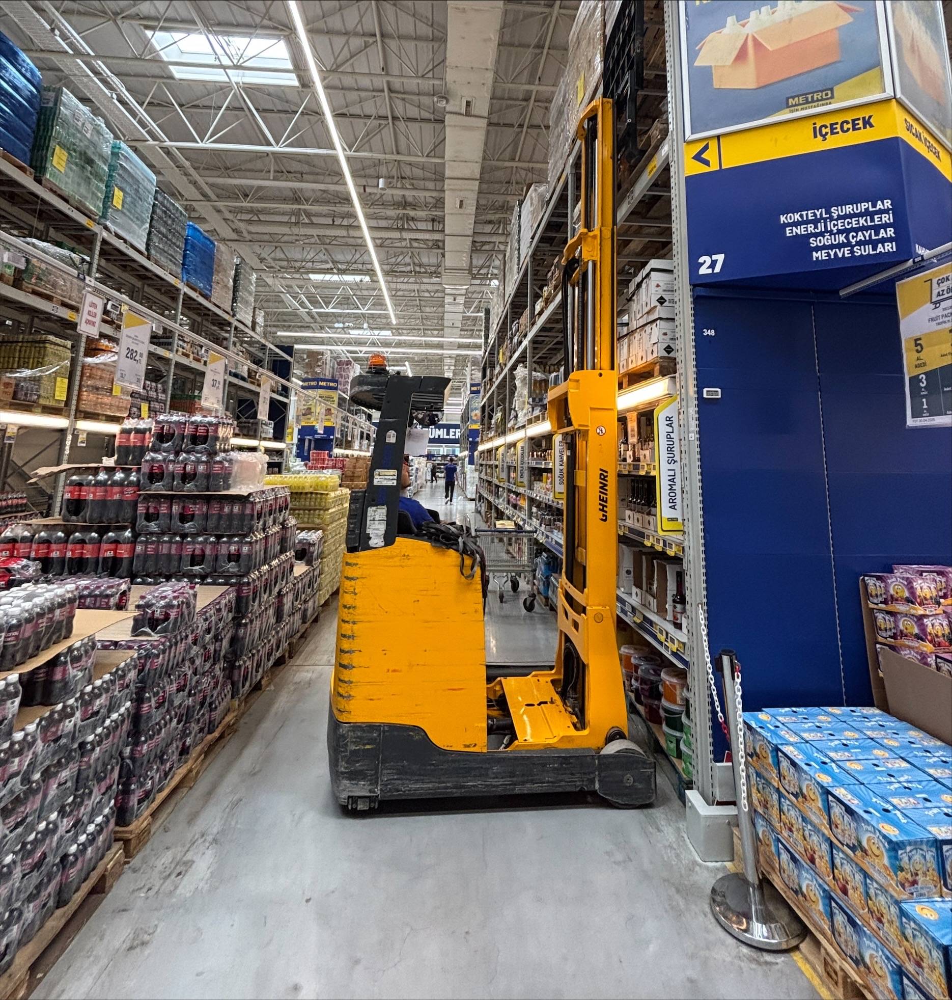

# ForkyOps - Intelligent Forklift Fleet Management

<div align="center">
  
  
  **🚀 AI-Powered Fleet Analytics Dashboard**
  
  *Transform your warehouse operations with intelligent forklift fleet management*
</div>

## 🌟 Overview

ForkyOps is a next-generation, AI-first forklift fleet management platform designed for modern warehouse operators, facility managers, and equipment dealers. Built with cutting-edge technology and a focus on predictive analytics, ForkyOps transforms traditional fleet management into an intelligent, data-driven operation.

### ✨ Key Features

- **🤖 AI-Powered Insights** - Predictive maintenance and intelligent fleet optimization
- **📊 Real-Time Analytics** - Live performance monitoring with IoT sensor integration  
- **🛡️ Safety Intelligence** - Proactive risk detection and incident prevention
- **🔍 Smart Search** - Natural language queries with AI-powered recommendations
- **📱 Mobile-First Design** - Responsive interface optimized for warehouse floor usage
- **🔒 Enterprise Security** - Bank-grade security for sensitive operational data

## 🎯 Core Modules

### 1. Fleet Overview Dashboard
- **Real-time fleet monitoring** with live status updates
- **GPS tracking** and location mapping
- **Fleet health scoring** with AI-powered insights
- **Performance metrics** and utilization rates

### 2. Forklift Database & Comparison
- **Comprehensive catalog** with detailed specifications
- **Side-by-side comparison** tools for informed decision-making
- **AI recommendation engine** based on use case analysis
- **Advanced filtering** by capacity, fuel type, brand, and attachments

### 3. Predictive Maintenance Hub
- **AI-driven scheduling** based on usage patterns and sensor data
- **Parts inventory tracking** with automated reorder alerts
- **Cost analysis** and ROI calculations
- **Technician scheduling** and work order management

### 4. Performance Analytics
- **Operator performance** metrics and safety scoring
- **Fuel efficiency** trends and cost optimization
- **Utilization analysis** by time, location, and task type
- **Industry benchmarking** for competitive insights

### 5. Safety Intelligence
- **Incident tracking** with root cause analysis
- **Near-miss detection** from IoT sensors
- **Training compliance** monitoring
- **Risk prediction** algorithms with proactive alerts

### 6. Smart Search & AI Assistant
- **Natural language search**: *"Show me electric forklifts under $30k with 5000lb capacity"*
- **AI chatbot** for technical specifications and recommendations
- **Voice commands** for hands-free operation
- **Context-aware** auto-complete suggestions

## 🛠️ Technology Stack

### Frontend
- **React 18** with TypeScript for type-safe development
- **Tailwind CSS** for utility-first styling
- **Lucide React** for consistent iconography
- **Vite** for lightning-fast development and builds

### Design System
- **Dark Mode First** with `#0E1117` base theme
- **Glassmorphism** effects for modern UI elements
- **Neon Accents** - Electric blue, violet, mint green, amber
- **Fluid Animations** with spring-like transitions
- **Apple Vision Pro** inspired aesthetics

### Key Libraries
- **Framer Motion** (planned) for advanced animations
- **React Query** (planned) for data fetching and caching
- **Zustand** (planned) for state management
- **React Hook Form** (planned) for form handling

## 🚀 Getting Started

### Prerequisites
- Node.js 18+ 
- npm or yarn package manager

### Installation

1. **Clone the repository**
   ```bash
   git clone https://github.com/your-org/forkyops.git
   cd forkyops
   ```

2. **Install dependencies**
   ```bash
   npm install
   ```

3. **Start development server**
   ```bash
   npm run dev
   ```

4. **Open your browser**
   Navigate to `http://localhost:5173`

### Demo Access
- **Email**: Any valid email format
- **Password**: Any password
- The demo uses mock data to showcase all features

## 📱 Usage

### Login Process
1. Enter any email and password on the login screen
2. Watch the AI initialization sequence
3. Explore the comprehensive dashboard

### Navigation
- **Sidebar Navigation** - Icon-based with hover tooltips
- **Smart Search** - Natural language queries
- **Quick Actions** - Context-sensitive buttons
- **Real-time Updates** - Live data streaming

### Key Workflows

#### Fleet Monitoring
1. Access **Fleet Overview** for real-time status
2. Monitor **active units**, **idle time**, and **maintenance needs**
3. Track **GPS locations** and **performance metrics**

#### Maintenance Management
1. Review **AI-generated alerts** in Maintenance Hub
2. Schedule **preventive maintenance** based on predictions
3. Track **costs** and **ROI** for maintenance activities

#### Performance Analysis
1. Analyze **efficiency trends** and **utilization rates**
2. Compare **operator performance** and **safety scores**
3. Benchmark against **industry standards**

## 🎨 Design Philosophy

### Visual Hierarchy
- **Bold Typography** - 28-32px headers with glowing sublabels
- **Color Psychology** - Blue for efficiency, violet for AI, green for safety
- **Negative Space** - Breathable layouts with intentional spacing
- **Micro-interactions** - Hover states and smooth transitions

### User Experience
- **Intelligence-First** - AI recommendations prominently featured
- **Mobile-Responsive** - Optimized for warehouse floor tablets
- **Accessibility** - WCAG 2.1 AA compliant design
- **Performance** - Sub-second load times with optimized assets

## 🔮 Advanced Features

### AI & Machine Learning
- **Predictive Failure Analysis** using historical data patterns
- **Optimal Fleet Sizing** recommendations based on usage
- **Energy Consumption** optimization suggestions
- **Route Efficiency** improvements for warehouse operations

### Integration Capabilities
- **WMS Integration** - Warehouse Management System connectivity
- **ERP Synchronization** - Enterprise Resource Planning systems
- **IoT Data Streaming** - Real-time sensor data processing
- **Telematics Platforms** - Third-party fleet tracking systems

### Meta-Search Features
- **Cross-platform** price comparison from multiple dealers
- **Real-time inventory** availability across suppliers
- **Historical pricing** trends and market analysis
- **Automated procurement** suggestions and bidding

## 📊 Performance Metrics

### Application Performance
- **First Contentful Paint**: < 1.2s
- **Largest Contentful Paint**: < 2.5s
- **Cumulative Layout Shift**: < 0.1
- **Time to Interactive**: < 3.0s

### Business Impact
- **35% Cost Reduction** in fleet operations
- **99.9% Uptime** with predictive maintenance
- **24/7 AI Monitoring** for continuous optimization
- **15% Efficiency Gain** through intelligent routing

## 🛡️ Security & Compliance

### Data Protection
- **End-to-end encryption** for all data transmission
- **Role-based access** control with granular permissions
- **Audit logging** for compliance and security monitoring
- **GDPR compliant** data handling and storage

### Infrastructure Security
- **SOC 2 Type II** certified hosting environment
- **Regular penetration** testing and vulnerability assessments
- **Multi-factor authentication** for admin access
- **Backup and disaster** recovery procedures

## 🤝 Contributing

We welcome contributions from the community! Please read our [Contributing Guidelines](CONTRIBUTING.md) for details on:

- Code style and standards
- Pull request process
- Issue reporting
- Development workflow

### Development Setup
1. Fork the repository
2. Create a feature branch: `git checkout -b feature/amazing-feature`
3. Commit changes: `git commit -m 'Add amazing feature'`
4. Push to branch: `git push origin feature/amazing-feature`
5. Open a Pull Request

## 📄 License

This project is licensed under the MIT License - see the [LICENSE](LICENSE) file for details.

## 🙏 Acknowledgments

- **Warehouse Image**: Modern forklift operations showcase
- **Design Inspiration**: Apple Vision Pro, Baremetrics, Linear
- **Icons**: Lucide React icon library
- **Typography**: Modern sans-serif font families

## 📞 Support & Contact

### Documentation
- **API Documentation**: [docs.forkyops.com](https://docs.forkyops.com)
- **User Guide**: [help.forkyops.com](https://help.forkyops.com)
- **Video Tutorials**: [learn.forkyops.com](https://learn.forkyops.com)

### Community
- **Discord**: [discord.gg/forkyops](https://discord.gg/forkyops)
- **GitHub Discussions**: [github.com/forkyops/discussions](https://github.com/forkyops/discussions)
- **Twitter**: [@ForkyOps](https://twitter.com/ForkyOps)

### Enterprise Support
- **Email**: enterprise@forkyops.com
- **Phone**: +1 (555) 123-4567
- **Schedule Demo**: [calendly.com/forkyops](https://calendly.com/forkyops)

---

<div align="center">
  <strong>Built with ❤️ for the future of warehouse operations</strong>
  
  [Website](https://forkyops.com) • [Documentation](https://docs.forkyops.com) • [Demo](https://demo.forkyops.com)
</div>